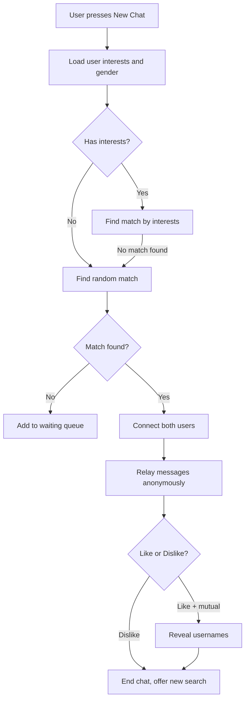

# AnonChat-Telegram-Bot


Anonymous chat bot for Telegram. Connects users randomly for anonymous conversations. Supports interests-based matching, gender filtering, VIP subscriptions via crypto payments, a leveling system, and full admin tooling.

## Features

- **Anonymous matching** — users are paired randomly with gender probability weighting
- **Interests system** — select hobbies to find partners with matching interests
- **VIP subscriptions** — paid via CryptoBot (USDT), unlocks gender filter and priority matching
- **Level & XP system** — experience points earned through activity, 50 levels with rewards
- **Full admin panel** — broadcast, user management, stats, VIP control, probability tuning
- **Media relay** — text, photos, stickers, audio, video, voice all forwarded anonymously

## Libraries Used

* **pyTelegramBotAPI**: Telegram Bot API wrapper, polling and handler registration.
* **SQLAlchemy**: ORM for SQLite database — users, interests, sessions, matches.
* **deep-translator**: Text translation via Google Translate (command `/translate`).
* **requests**: HTTP client for CryptoBot payment API.
* **schedule**: Background scheduler for checking expired subscriptions hourly.
* **configparser**: Config file parsing for tokens and VIP list.

## Project Structure

```
anonchat/
├── main.py                     # Entry point, scheduler, handler imports
├── config_files/
│   └── config.ini              # Tokens, admin ID, VIP list
├── bot/
│   ├── shared.py               # Shared bot instance, helpers, keyboards
│   ├── Messages.py             # All user-facing message strings
│   ├── crypto_payments.py      # CryptoBot API, subscription logic
│   └── handlers/
│       ├── start.py            # /start /stop, gender selection, chat relay
│       ├── chat.py             # /profile /interests /translate
│       ├── vip.py              # /vip /subscribe, payment callbacks
│       └── admin.py            # All 15 admin commands
├── database/
│   ├── models.py               # SQLAlchemy models: User, Interest, UserStats
│   └── dataEngine.py           # Data access layer, matching logic
├── utils/
│   ├── interests.py            # Interest list and keyboard builder
│   ├── levels.py               # XP/level calculations
│   ├── profile_utils.py        # Progress bar, rank titles
│   └── admin_utils.py          # VIP config read/write helpers
├── profile_photos/             # Level-based profile images (level_1.jpg ... level_50.jpg)
├── w.jpg                       # Welcome screen photo
├── vip_panel.jpg               # VIP panel photo (optional)
└── requirements.txt
```

## Installation

### 1. Clone the repository

```bash
git clone https://github.com/yourusername/anonchat-bot.git
cd anonchat-bot
```

### 2. Install dependencies

```bash
pip install -r requirements.txt
```

### 3. Configure

Create `config_files/config.ini`:

```ini
[Telegram]
access_token = YOUR_BOT_TOKEN
admin_id = YOUR_TELEGRAM_ID

[VIP]
vip_users =

[CryptoBot]
api_token = YOUR_CRYPTOBOT_TOKEN
```

- **Bot token** — get from [@BotFather](https://t.me/BotFather)
- **admin_id** — your Telegram user ID (get from [@userinfobot](https://t.me/userinfobot))
- **CryptoBot token** — get from [@CryptoBot](https://t.me/CryptoBot) → My Apps

### 4. Add photos (optional)

Place images in the project root:
- `w.jpg` — shown on `/start`
- `vip_panel.jpg` — shown on `/vip`
- `profile_photos/level_1.jpg` through `level_50.jpg` — shown on `/profile`

Bot works without photos — falls back to text messages automatically.

### 5. Run

```bash
python main.py
```

## Usage

### User commands

| Command | Description |
|---|---|
| `/start` | Register and get welcome message |
| `/stop` | Leave current chat or queue |
| `/profile` | View your level, XP, rank, and progress |
| `/interests` | Choose hobbies for better matching |
| `/translate lang text` | Translate text (e.g. `/translate en Привет`) |
| `/subscribe` | Buy VIP subscription via crypto |
| `/mysubscription` | Check active subscription status |
| `/vip` | Open VIP control panel (VIP users only) |

### Admin commands

| Command | Description |
|---|---|
| `/adminhelp` | Full list of admin commands |
| `/advert` | Broadcast message to all users |
| `/stats` | Bot statistics: users, exp, levels, matching |
| `/users [page] [gender] [status]` | Paginated user list with filters |
| `/getuser user_id` | Full user info |
| `/setgender user_id male\|female` | Change user gender |
| `/setexp user_id value` | Set experience points |
| `/addexp user_id amount` | Add or subtract experience |
| `/setlevel user_id level` | Set user level |
| `/setprob mm mf ff fm` | Set matching probabilities (must sum to 100) |
| `/vip_add user_id [days]` | Grant VIP access manually |
| `/vip_list` | List all VIP users with status |
| `/vip_manual add\|remove\|status\|list` | Advanced VIP management |

## How It Works



## VIP Subscription Plans

| Plan | Price | Duration |
|---|---|---|
| Monthly | $0.10 | 30 days |
| 3 Months | $24.99 | 90 days |
| Yearly | $79.99 | 365 days |

VIP unlocks: gender filter search, priority in match queue, faster connection, extended statistics.

## Technical Notes

- **Session safety** — all SQLAlchemy objects are read into primitives inside `with session()` blocks to avoid `DetachedInstanceError` after session close.
- **Handler order** — `start.py` is imported last so its catch-all `relay()` handler does not intercept commands registered in other modules.
- **Subscription sync** — `is_vip()` auto-cleans stale config entries when a subscription has expired, keeping config and database in sync.
- **Databases** — `anon_chat.db` for users and interests, `subscriptions.db` for VIP subscriptions. Both created automatically on first run.
